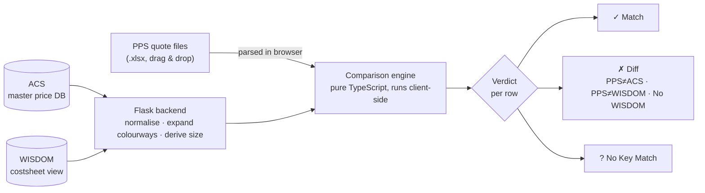

# PPS · ACS · WISDOM 3-Way Validator

**Catches FOB price mismatches across three systems before they turn into a wrong purchase order.**

A web dashboard that takes a batch of PPS quote files and checks every row's price against two
authoritative databases at once — flagging the disagreements, explaining *which* source disagrees,
and letting the team annotate and export the result.

<p>
  
  
  
  
  
</p>

---

## The problem

The same garment style carries a FOB price in three different places:

| Source | What it is |
| --- | --- |
| **PPS** | The quote actually sent out — the number that becomes an order |
| **ACS** | The master per-style / per-colour / per-size price database |
| **WISDOM Costsheet** | The newer costsheet view, which *should* agree with ACS |

They drift. Someone updates one and not the others, or a quote goes out against a stale price.
Finding those cases was a manual Excel VLOOKUP-and-eyeball job — too slow and too error-prone for
the volume of rows moving through the ordering process, and a missed mismatch is a real cost.

This tool replaces that workflow.

## What it does

- **Drag and drop up to 4 PPS files** — parsed entirely in the browser, nothing uploaded to a server.
- **Pulls ACS and Costsheet automatically** from SQL Server, so there is nothing to export by hand.
- **Matches rows the way a human would** — normalising sizes, falling back through five levels of
  size specificity, expanding multi-colourway rows, and picking the newest costsheet entry.
- **Gives every row a verdict** — Match, Diff (with a chip naming *which* source disagrees), or
  No Key Match, with diagnostics showing what ACS *does* have for related keys.
- **Shared annotations** — an *Error From* dropdown and a *Done* checkbox per row, saved server-side,
  so what one person marks the next person sees, stamped with who saved it.
- **Summary view** — a Match / Diff / No Key donut per factory plus a factory × season breakdown,
  never lumping factories together.
- **CSV export** of the full comparison, annotations included.
- **Active Directory login** with per-group editor / read-only roles enforced on both the UI and the API.

## How it works



All three sources are read **read-only**. The only thing the app ever writes is its own small
annotations database — the row notes, groups and audit log.

## The comparison, in short

Order of operations is the whole game. The backend prepares the data, the browser does the matching:

**Backend** — stringify every cell, derive a normalised size from the row ID, then expand
multi-colourway rows into one row per colourway.

**Browser** — collapse currency twins, then collapse quote history down to the live quote, index ACS
by *season · style · colour · factory*, and for each PPS row:

1. Pick the best ACS row using a **5-tier size fallback**
2. Pick the right ACS price column — regular vs extended size
3. Pick the costsheet row with the **newest input date within the size-matched subset**
4. Compare, and emit a verdict

A row is a **Match** only when every loaded source agrees — with the costsheet loaded, all three;
without it, PPS against ACS alone. A row whose costsheet entry is simply *missing* is a Diff, not a
pass: a three-way check can't be confirmed when a source has no data.

The full rule-by-rule breakdown — all 24 rules, in pipeline order, with the landmines each one has
caused — is in the [handover documentation](docs/HANDOVER.md#core-logic).

## Tech stack

| Layer | Choice | Why |
| --- | --- | --- |
| **Backend** | Python · Flask, served by waitress | Small surface: fetch, normalise, serve |
| **Database** | SQL Server via ODBC, Windows integrated auth | Read-only access to the systems of record |
| **Frontend** | Vite · React 18 · TypeScript (strict) | Fast builds, typed domain logic |
| **Parsing** | SheetJS (`xlsx`) | PPS files never leave the browser |
| **Annotations** | SQLite | The one thing the app writes |
| **Styling** | Plain CSS with design tokens | No framework; light/dark from one token file |

Deliberately **no** Redux, no React Query, no chart library and no CSS framework. The comparison
logic lives in `frontend/src/lib/` as pure functions with **zero React**, which is what makes it
unit-testable — and it is the part that matters most.

## Screenshots

<!-- Drop images into docs/images/ and uncomment:

| Compare view | Summary view |
| --- | --- |
|  |  |

-->

*Screenshots coming — add PNGs to `docs/images/` and uncomment the block above.*

## Getting started

You'll need Python 3.9+, Node 18+, the Microsoft ODBC Driver 17 or 18 for SQL Server, and a Windows
account with `SELECT` on the two source tables.

```powershell
# 1. configure — copy the template and fill in your SQL Server details
copy .env.example .env

# 2. backend
py -m pip install -r requirements.txt
py .\serve.py            # → waitress serving on http://0.0.0.0:5001

# 3. frontend, in a second terminal
cd frontend
npm install
npm run build
```

Full step-by-step setup, including what "working" looks like at each stage and the three database
errors that account for almost every failed first run:
**[docs/HANDOVER.md → First run](docs/HANDOVER.md#first-run--zero-to-a-working-dashboard)**

## Documentation

Everything technical lives in one place — **[docs/HANDOVER.md](docs/HANDOVER.md)**, written so a new
engineer can take ownership without asking questions:

| If you want to… | Go to |
| --- | --- |
| Run it for the first time | [First run](docs/HANDOVER.md#first-run--zero-to-a-working-dashboard) |
| Understand the matching rules before changing them | [Core logic](docs/HANDOVER.md#core-logic) |
| Know which file does what | [File map](docs/HANDOVER.md#0-file-map--which-file-does-what) |
| Dig into the domain logic | [Domain logic deep dive](docs/HANDOVER.md#6-domain-logic--deep-dive) |
| Work on login and permissions | [Authentication](docs/HANDOVER.md#authentication--ad-login-and-sessions) |
| Add a column, size or data source | [Extending the app](docs/HANDOVER.md#11-extending-the-app) |
| Fix something that's broken | [Troubleshooting](docs/HANDOVER.md#12-troubleshooting) |

## Status

Running as an internal deployment on the company network. Authentication, per-group roles, shared
annotations and the summary view are all built and in use. Remaining work before a wider rollout is
infrastructure rather than application code — HTTPS, a stable hostname and production secrets — all
tracked in the [go-live checklist](docs/HANDOVER.md#production-go-live-checklist).

---

<sub>Internal tooling. Database hostnames, network addresses and directory configuration are kept out
of this repository — see `.env.example` for the shape of the configuration required.</sub>
